# Как работает рендеринг компонентов (Block + registerComponent)

Разбор на живом примере: `MessageInput` (родитель) с дочерними `Input` и `Button`.

Файлы:

- `src/components/core/block.ts` — базовый класс `Block`
- `src/components/core/registerComponent.ts` — мост между `Block` и Handlebars
- `src/components/molecules/message-input/message-input.ts` — родитель
- `src/components/molecules/input/index.ts` — регистрация `Input`

---

## Две фазы жизни

Важно различать **когда** что происходит:

1. **Фаза регистрации** — один раз, при загрузке модулей (`import`).
2. **Фаза рендеринга** — каждый раз при `element()` / `render()` / `setProps()`.

---

## Фаза 1. Регистрация (один раз, при импорте)

`input/index.ts` исполняет `registerComponent(Input)`. Это **не создаёт** ни одного `Input` —
он лишь регистрирует в Handlebars **хелпер** с именем `Input` и закрепляет за классом
уникальный плейсхолдер-id.

```
registerComponent(Input)
        │
        ├─ uniqueId++  →  dataAttribute = 'data-component-hbs-id="1"'   (фиксируется в замыкании)
        │
        └─ Handlebars.registerHelper('Input', fn)   ← теперь {{{ Input ... }}} в любом шаблоне
                                                       вызывает fn
```

Так же регистрируются `Button` (id=2), `MessageInput` и т.д. Один id **на класс**, а не на
экземпляр — все будущие `Input` делят `data-component-hbs-id="1"`.

> Аналогия C#: это как один раз зарегистрировать тип в DI-контейнере. Объектов ещё нет —
> есть только «рецепт», как их делать, когда они понадобятся.

---

## Фаза 2. Рендеринг `new MessageInput().element()`

### Общая последовательность

```mermaid
sequenceDiagram
    participant Caller
    participant MI as MessageInput (Block)
    participant HB as Handlebars
    participant Helper as хелпер "Input"
    participant Inp as Input (экземпляр)

    Caller->>MI: element()
    MI->>MI: render() → compile()
    MI->>HB: compile(template)(this.props)
    Note over HB: встретил {{{ Input ... ref="input" }}}
    HB->>Helper: вызов с hash (props инпута)
    Helper->>Inp: new Input(hash)
    Helper->>Inp: element()  (т.к. есть ref)
    Inp-->>Helper: готовый DOM-узел <div class="input">
    Helper-->>HB: строка '<div data-component-hbs-id="1"></div>'
    Note over HB: то же для {{{ Button }}} → id="2"
    HB-->>MI: HTML-строка с плейсхолдерами
    Note over MI: props.__children и props.__refs уже заполнены хелперами
    MI->>MI: для каждого child → embed(fragment)
    Note over MI: embed находит плейсхолдер и replaceWith(реальный узел)
    MI->>MI: querySelectorAll('[ref]') → this.refs (элементные)
    MI-->>Caller: корневой <form>
```



### Что именно делает `compile()` (block.ts:50)

```
this.props ──────────────► становится data.root внутри хелперов
     │
     ▼
Handlebars.compile(template)(this.props)
     │
     │  По ходу шаблона каждый {{{ Component }}} дёргает свой хелпер,
     │  а хелпер ПОБОЧНО мутирует data.root (== this.props):
     │     • data.root.__children.push({ component, embed })
     │     • data.root.__refs["input"] = component.element()   (если есть ref=)
     │
     ▼
HTML-строка:
   <form class="message-input">
     <div data-component-hbs-id="1"></div>   ← плейсхолдер Input
     <div data-component-hbs-id="2"></div>   ← плейсхолдер Button
   </form>
```

После строки рендерятся два шага:

```
1) this.children = __children.map(c => c.component)   // [Input, Button] — для жизненного цикла
2) __children.forEach(child => child.embed(fragment)) // замена плейсхолдеров на реальные узлы
3) this.refs = querySelectorAll('[ref]') (+ __refs)   // элементные ref внутри ЭТОГО шаблона
```

---

## Что делает `registerComponent` (хелпер) — крупным планом

Когда Handlebars дошёл до `{{{ Input ... ref="input" }}}`:

```
hash = { aria-label, validation-regex, type, name, ..., ref: "input" }

function helper({ hash, data }) {
    const component = new Input(hash);           // (A) создаём экземпляр

    if ('ref' in hash)                           // (B) ref → кладём в __refs РОДИТЕЛЯ
        data.root.__refs["input"] = component.element();
                                                 //     ⚠ element() здесь СРАЗУ строит DOM инпута
                                                 //        (рекурсивный compile самого Input)

    data.root.__children.push({                  // (C) регистрируем для встраивания
        component,
        embed(node) { ... }                      //     замыкание помнит dataAttribute="...1"
    });

    return '<div data-component-hbs-id="1"></div>'; // (D) плейсхолдер вместо компонента
}
```

Ключевое: хелпер **не вставляет** компонент в DOM. Он возвращает «заглушку» и
**откладывает** реальную вставку в `embed`, который вызовет родитель.

---

## Что делает `embed`

`embed` — это «вклеить готовый узел вместо заглушки»:

```
embed(fragment):
    placeholder = fragment.querySelector('[data-component-hbs-id="1"]')
    element     = component.element()      // тот же узел (element() кэширует domElement)
    placeholder.replaceWith(element)       // заглушка → реальный <div class="input">
```

Визуально превращение фрагмента:

```
ДО embed:                            ПОСЛЕ embed:
<form class="message-input">         <form class="message-input">
  <div data-component-hbs-id="1">      <div class="input"> … <input> … </div>
  <div data-component-hbs-id="2">      <button class="button">Отправить</button>
</form>                              </form>
```

> Почему через плейсхолдер, а не сразу? Handlebars умеет возвращать только **строки**.
> DOM-узел в строку не засунешь, поэтому хелпер оставляет текстовый «маркер», а реальный
> узел вклеивается уже после парсинга HTML, на этапе работы с `fragment`.

---

## Полная картина: дерево вызовов

```
new MessageInput().element()
└─ render()
   └─ compile()                                   [block.ts:50]
      ├─ Handlebars.compile(template)(props)
      │  ├─ helper "Input"                         [registerComponent.ts:9]
      │  │  ├─ new Input(hash)
      │  │  ├─ Input.element() → render() → compile()   ← РЕКУРСИЯ: строит DOM инпута
      │  │  ├─ props.__refs["input"] = <узел input>
      │  │  ├─ props.__children.push({Input, embed})
      │  │  └─ return '<div data-...="1">'
      │  └─ helper "Button"  → '<div data-...="2">'
      ├─ this.children = [Input, Button]
      ├─ Input.embed(fragment)   → replaceWith реальный <div class="input">
      ├─ Button.embed(fragment)  → replaceWith реальный <button>
      └─ this.refs = { input: <узел input> }       (из __refs + элементных ref)
```

---

## Важные нюансы

- **`element()` кэширует.** В хелпере (B) и в `embed` он вызывается дважды, но `domElement`
  создаётся один раз — второй вызов возвращает тот же узел. Поэтому повторного рендера нет.
- **id плейсхолдера — на класс, а не на экземпляр.** Два `Input` в одном шаблоне получат
  одинаковый `data-component-hbs-id`; `embed` берёт первый оставшийся плейсхолдер, а
  `replaceWith` его убирает — следующий `embed` находит следующий. Срабатывает «по расходу».
- **`__children` и `__refs` живут в `props`.** Хелперы пишут в `data.root`, а это и есть
  `this.props` родителя (см. `compile`). Поэтому `setProps` сбрасывает их в `{}` —
  иначе при перерисовке остались бы ссылки на старых детей.
- **Два вида `ref` лежат вместе в `this.refs`:** элементные (из `querySelectorAll('[ref]')`)
  и компонентные (из `__refs`, где хранится `component.element()` — то есть **DOM-узел**, а не
  экземпляр `Block`). Именно поэтому достучаться до методов дочернего компонента через `ref`
  сейчас нельзя — это предмет отдельного рефакторинга (`componentRefs`).
